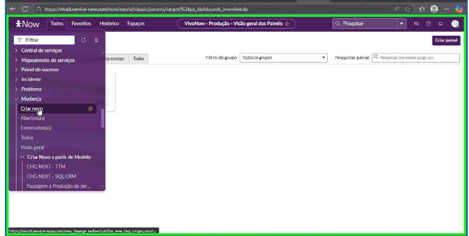
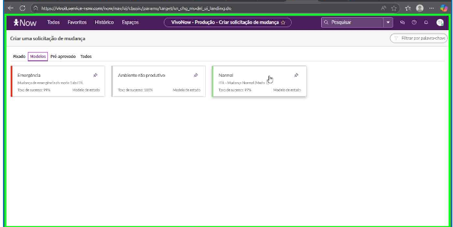
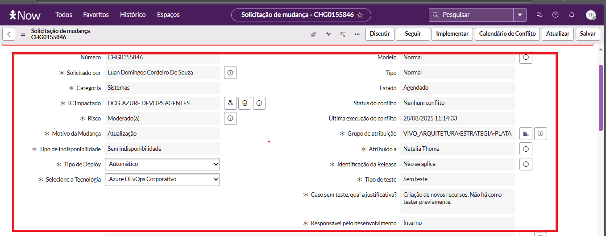
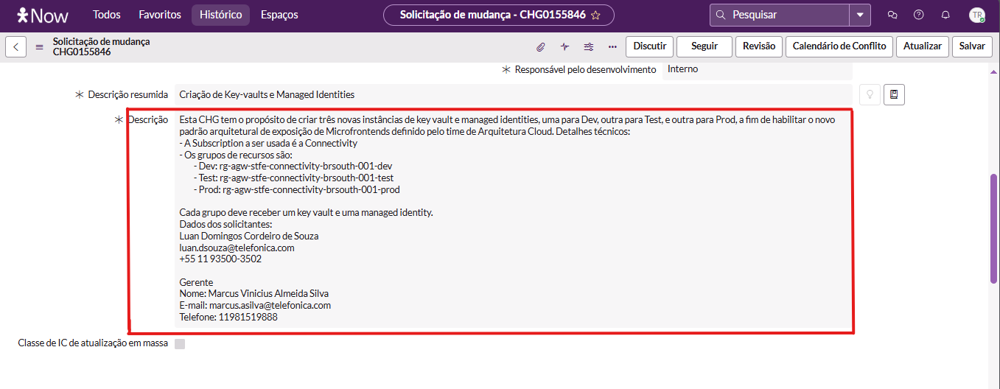
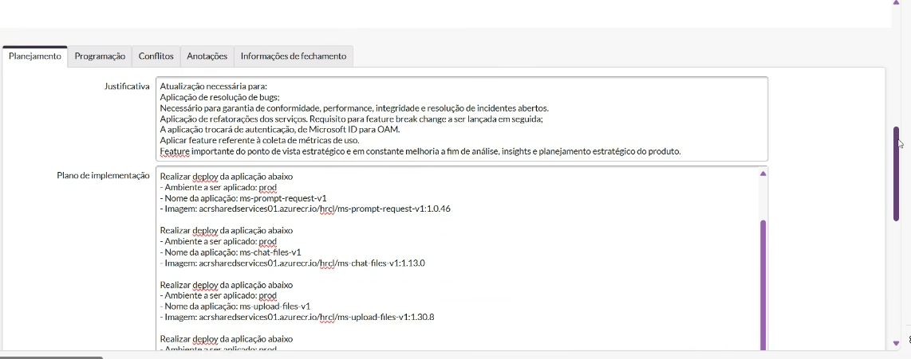
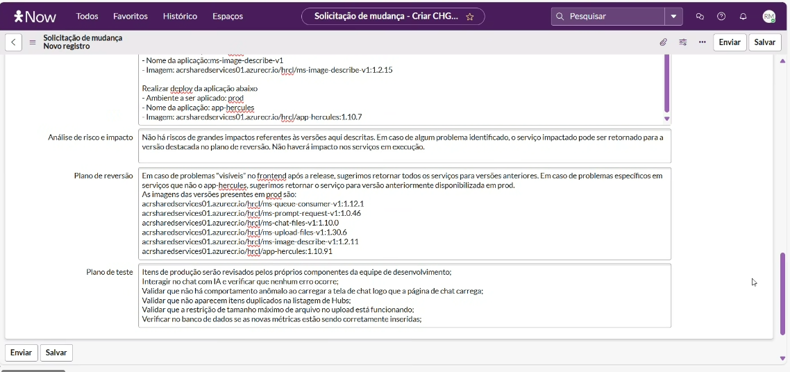
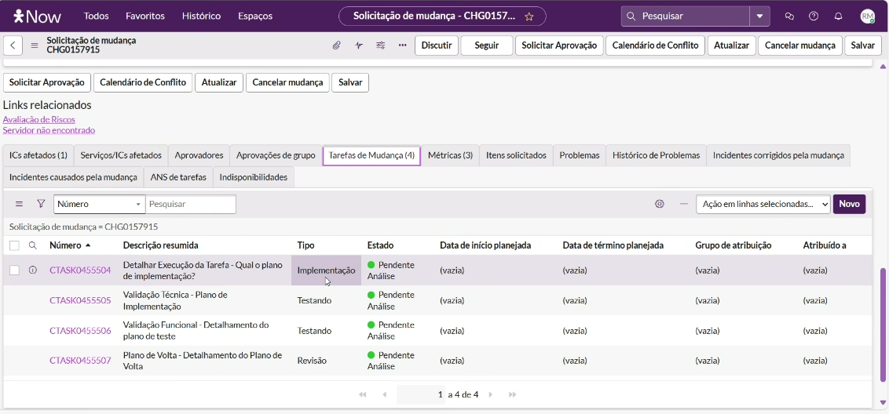
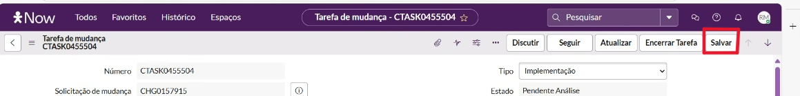

<h1>Documentação de Criação de CHG</h1>

## Índice
- Objetivo
- O que é CHG?
- Como criar um CHG?
- Motivos comuns de reprovação de Mudança
- IA Validator

## Objetivo
Essa documentação tem como objetivo informar como funciona o processo de criação de um CHG no VivoNow com o preenchimento adequado dos campos obrigatórios.

## O que é CHG?
 CHG é a sigla para Change ou Mudança e refere-se ao momento da implantação de novas funcionalidades, correções, remoção de toggle, entre outros tipos de histórias em produção. Esse momento ocorre de forma acordada com demais squads e para que ocorra uma change em produção é necessário passar por alguns processos que vão desde a abertura da change no VivoNow, passando pelas aprovações e alinhamentos com os times de PCP, sustentação, GMUD, QD, até a execução da promoção para produção em data e hora combinada.

## Como criar uma CHG?
 Para solicitar a criação de uma CHG siga os passos abaixo:

- Acesse a área "Solicitação de Mudança"
1. Acesse a área "Solicitação de Mudança" no VivoNow.
2. Clique em "Todos" > "Mudança" > "Criar novo" > "Modelos" > "Normal", conforme imagens abaixo. Ou acesse a área <a href="https://vivoit.service-now.com/now/nav/ui/classic/params/target/sn_chg_model_ui_landing.do"> Modelos </a> clicando aqui e depois clique em "Normal".

- Preencha os campos obrigatórios
 
 As informações que podem aparecer e que devem ser preenchidas, como demonstrado na imagem acima, são:

 **Número:** Gerado automaticamente para consulta.

 **Solicitado por:** Nome do responsável pela abertura.

 **Categoria:** Selecione "Sistema".

 **IC Impactado:** Informe todos os ICs afetados.

 **Risco:** Calcule no campo "Calcular Risco" e informe o antes de enviar.

 **Motivo da Mudança:** Selecione entre Nova Funcionalidade, Correção ou Atualização.

 **Manutenção:** Por ser uma ação proativa garantindo a manutenção dos ambientes/servidores, não tem origem nenhuma. Caso esteja abrindo a CHG de entrega mensal do MVE, utilize "Nova Funcionalidade"

 **Tipo de Indisponibilidade:** Informe se haverá indisponibilidade total(quando ocupa toda a janela), parcial (quando ocupa parte da janela) ou nenhuma.

 **Tipo de Deploy:** Selecione Automático ou Manual. Observação: Caso o Deploy esteja sendo realizado de forma automática, a região **Selecione a Tecnologia** vai ser apresentado;

 **Selecione a Tecnologia:** Escolha entre Azure DevOps Corporativo e Jenkings Corporativo.

 **Estado:** Demonstra estado de criação de CHG.

 **Status do Conflito:** Não precisa ser preenchido*

 **Grupo de atribuição:** Informe o grupo atribuido a CHG.

 **Atribuído a:** Informe quem vai ser responsável pela CHG.

 **Identificação da Release:** Informe a Identificação que vai ser usada.

 **Tipo de teste:** Informe o tipo de teste que forem realizar.

 **Responsável pelo desenvolvimento:** Nome do responsável pelo desenvolvimento da Change.

 **Descrição resumida:** Informe o título da sua CHG, podendo ser uma descrição genérica.
 **Descrição:** Preencher com informações sobre a CHG que está sendo criada, exemplo na imagem abaixo:
 

- Preencha as 5 regiões abaixo
 <igm src="">

 **Planejamento:** Separado em 5 partes:
 
 
    Justificativa: Informe a necessidade para criação da CHG.
    Plano de Implementação: Informe o plano de implementação do time (informações de forma resumida dos passos a serem seguidos pela equipe durante a Change).
    Análise de risco e impacto: Apontamento dos tipos de riscos que a Mudança pode gerar em seu desenvolvimento.
    Plano de reversão: Descreva o que vai ser feito em caso de incidentes/problemas ocasionados durante a Change.
    Plano de teste: Informe os processos de testes que serão executados pelo time.

**Programação:** Preenchida com as datas de início e término planejadas para Mudança (Observação: Essa área deve ser informada de forma bem planejada para com data e hora para desenvolvimento da CHG);

**Anotações:** A comunicação entre o solicitante responsável pela CHG e o time que realiza a aprovação da Change é feita através dessa aba.

- Finalize preenchendo as tarefas de mudança.
Na parte mais baixa da página, clicando em **Tarefas de Mudança**, encontrará 4 tipos de tarefas de mudanças para preencher e, para fazer isso, é só clicar em cada um dos links marcados em **Número**

Tipos de Tarefas de Mudança:

° Implementação;
° Validação Técnica;
° Validão Funcional;
° Plano de Volta.

O preenchimento de cada uma dessas tarefas deve estar de acordo com a imagem abaixo. Por fim, salve todas as infomações da solicitação clicando em **Salvar** na região mais alta em todas as páginas preenchidas anteriormente.

## Motivos comuns de reprovação de Mudança
° **Preenchimento incorreto ou incompleto do campo "Descrição"** 

 A reprovação pode ser ocasionada devivo o preenchimento inadequado do campo "Descrição" presente no formulário de criação da CHG, sendo importante adicionar de forma detalhada as informações sobre a Mudança e do time envolvido nela, conforme exemplo na imagem abaixo.

 

° **Data e hora de execução da Mudança**
 

 A data de execução das Mudanças deve ser alinhada com o seu time e sem interferir com o calendário de execução de Mudanças a serem efetuadas durante este período, esse calendário pode ser encontrado no **Portal GMUD**, você pode acessar o portal clicando em <a hrelf="https://telefonicacorp.sharepoint.com/sites/Colabora_Brasil/PortalGMUD/SitePages/Portal-GMUD.aspx?xsdata=MDV8MDJ8fDYyMmFmOGFjMjUwYTRlNjAxZDRhMDhkZGU5ODZjYjNhfDZlNjhlNmE2NGQ2YjQ1MDU5NjIyZmRkYWY4Y2ZjNzU1fDB8MHw2Mzg5MjM0ODczMDA5NTEzNzB8VW5rbm93bnxWR1ZoYlhOVFpXTjFjbWwwZVZObGNuWnBZMlY4ZXlKRFFTSTZJbFJsWVcxelgwRlVVRk5sY25acFkyVmZVMUJQVEU5R0lpd2lWaUk2SWpBdU1DNHdNREF3SWl3aVVDSTZJbGRwYmpNeUlpd2lRVTRpT2lKUGRHaGxjaUlzSWxkVUlqb3hNWDA9fDF8TDJOb1lYUnpMekU1T20xbFpYUnBibWRmVFZSRmQxcFVVWGxOYlVWMFdUSkdhRTVETURCT2JVVXdURmRGZWsxdFNYUk9lbFpvVG5wQ2JVNHlUbWxhUkVGNVFIUm9jbVZoWkM1Mk1pOXRaWE56WVdkbGN5OHhOelUyTnpVeE9USTVOVFU0fDNmNzNkODRiOTliODQyZjRiYWVhMDhkZGU5ODZjYjM3fGEzZGFlMzU1YTliNzQ1Zjc4ODc5NDhhNjU0NGFkODhk&sdata=VUVPeE5CVEV0Ty93OHNPUWowWGpxT2UyaDZNZDNCem51NjhlT0llZTNpRT0%3D&ovuser=6e68e6a6-4d6b-4505-9622-fddaf8cfc755%2Cthaina.rocco%40fcamara.com&OR=Teams-HL&CT=1756861152421&clickparams=eyJBcHBOYW1lIjoiVGVhbXMtRGVza3RvcCIsIkFwcFZlcnNpb24iOiI0OS8yNTA4MTUwMDcxNyIsIkhhc0ZlZGVyYXRlZFVzZXIiOmZhbHNlfQ%3D%3D"> link </a>.
 **Atenção**: Caso não possua acesso a este portal, entre em contato com o seu time para que possam fornecer este acesso e verificar as datas de execução das CHG's.
 E o horário de execução da Change também deve ser marcada sem resultar no conflito de execução marcada a alguma outra CHG para não haver conflito na execução desta e sempre mantendo o padrão de horário do plano de início (00h) e de volta (05h) da Mudança.

- **Motivo de Mudança**

 Caso adicione **Nova funcionalidade** neste campo, será necessário vincular um projeto do JIRA para que a funcionalidade. Porém, se o motivo da mudança não se qualifica a esta opção e a outras (corrigir/reparar e mnutenção), uma opção que pode ser marcada é "Atualização".

## IA Validator 
O IA Validator é uma ferramenta desenvolvida para automatizar e validar informações das CHGs de forma inteligente, facilitando o dia a dia e reduzindo erros.
 ° Como acessar e instalar?
Confira o manual completo de instalação e uso 
🔗 [Manual IA - GMUD (IA Validator)](https://wikicorp.telefonica.com.br/spaces/AC/pages/677776363/Manual+IA+-+GMUD)